<h2>Injection des dépendances et Inversion de controle</h2>

<h3>Partie 1 : </h3>
<h4>1. Créer l'interface IDao avec une méthode getDate</h4>
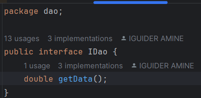
<h4>2. Créer une implémentation de cette interface</h4>
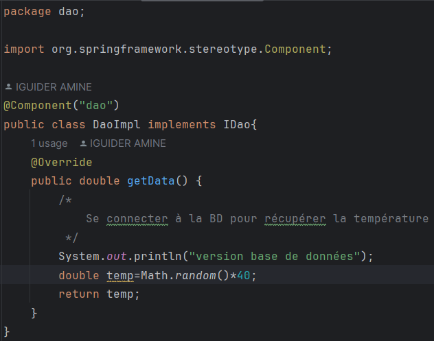
<h4>3. Créer l'interface IMetier avec une méthode calcul</h4>
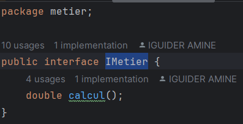
<h4>4. Créer une implémentation de cette interface en utilisant le couplage faible</h4>
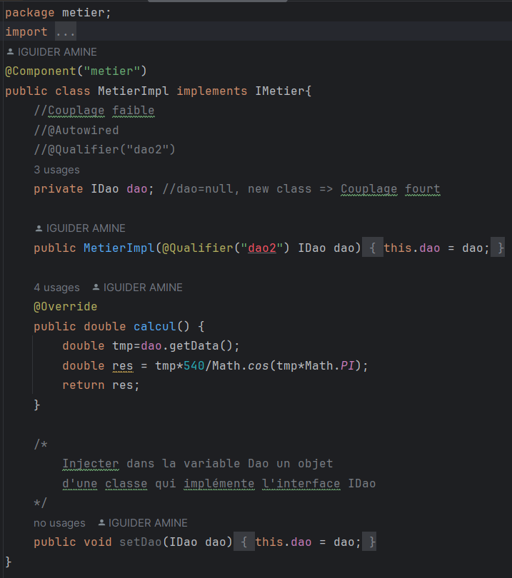
<h4>5. Faire l'injection des dépendances :</h4>
    <h5>a. Par instanciation statique</h5>
        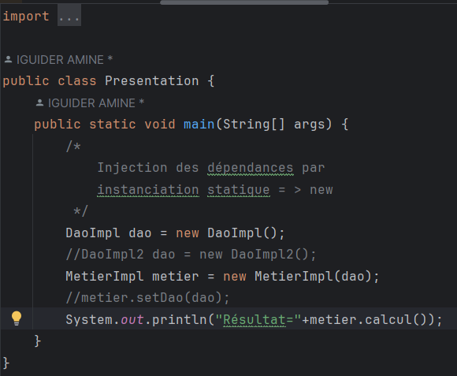
        <h6>Résultat :</h6>
        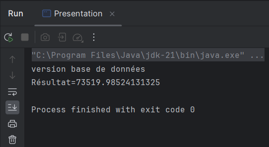
    <h5>b. Par instanciation dynamique</h5>
        <h6>Config file :</h6>
        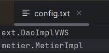
        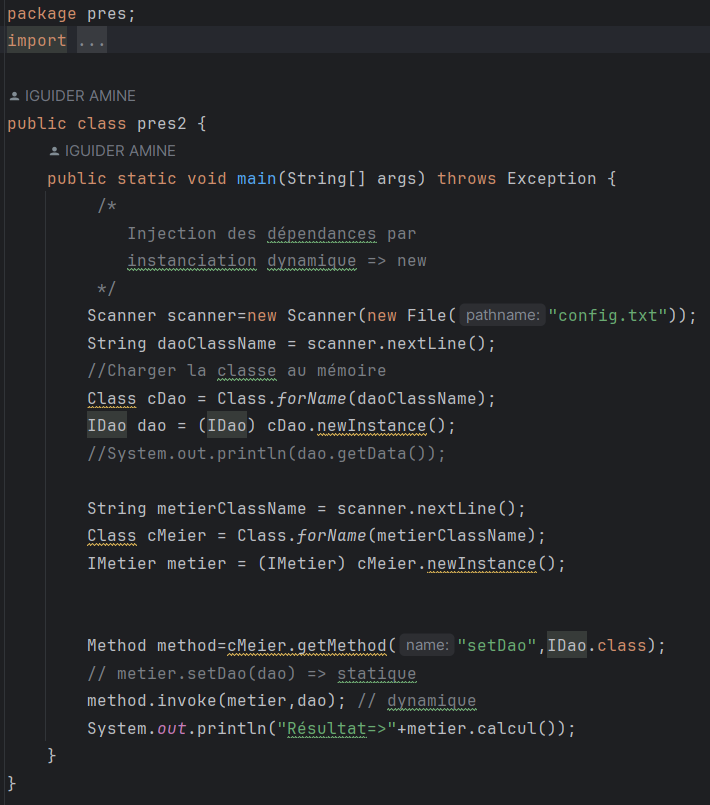
        <h6>Résultat :</h6>
        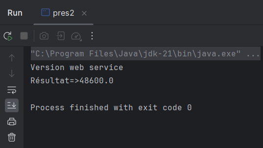
    <h5>c. En utilisant le Framework Spring</h5>
    <h6>- Version XML</h6>
    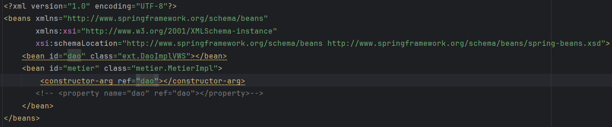
    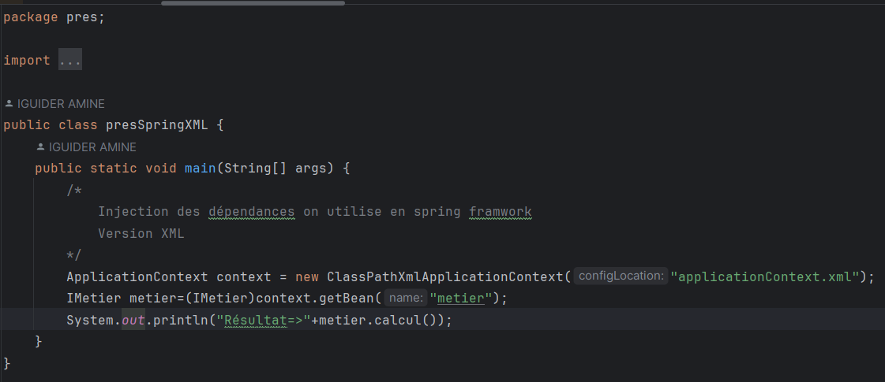
    <h6>- Version annotations</h6>